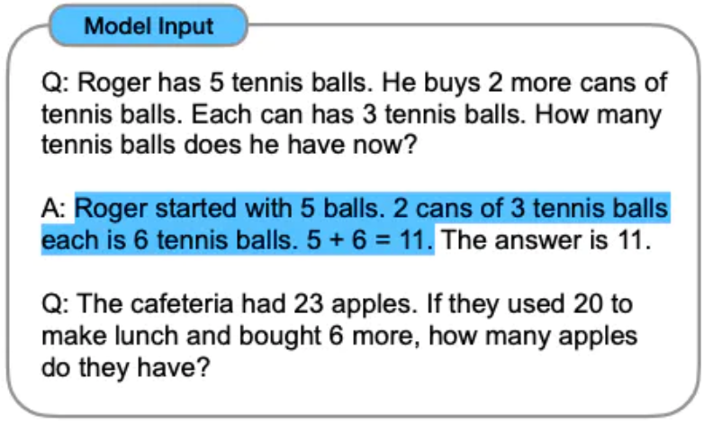
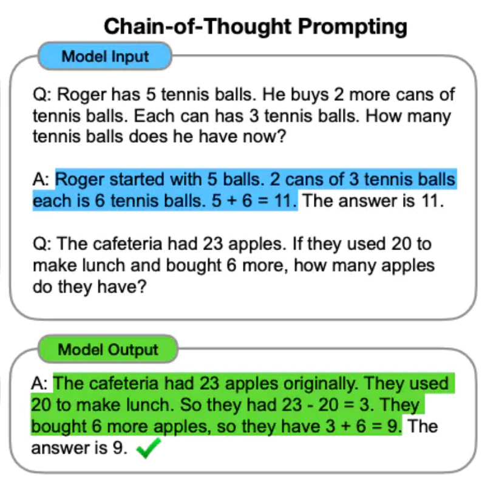
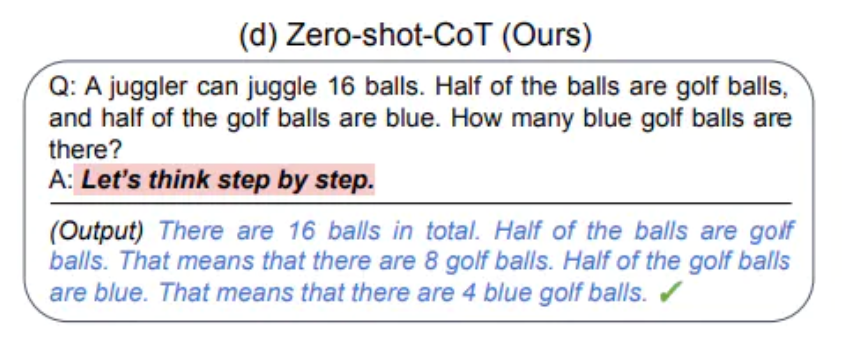
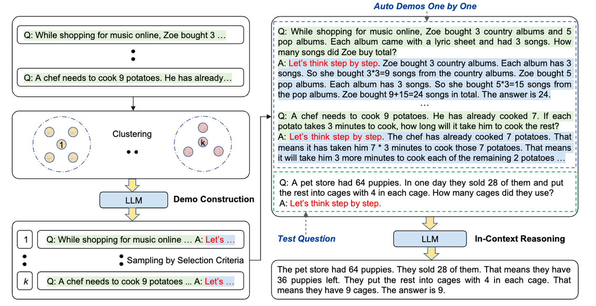

# CoT(Chain of Thought) 思维链
CoT(Chain of Thought) 指回答答案前的一系列中间推理步骤。下图的蓝色部分就是 CoT：


LLM 如果生成 CoT：

1. 能显著提高 LLM 执行复杂推理的能力。仅用八个思想链示例提示一个540 B参数语言模型，就可以在GSM 8 K数学单词问题基准测试中达到最先进的准确性，甚至超过了使用验证器的微调GPT-3。
2. 对于更复杂的问题，思维链提示具有更大的性能增益。
3. **CoT 不会对小规模的模型(参数小于 10B)产生积极影响。**较小规模的模型产生流畅但不合逻辑的思想链，导致性能低于标准提示。

测不同模型，在不同数据上的输出效果，可以运行 [zero_shot_cot](https://github.com/kojima-takeshi188/zero_shot_cot/tree/main) ：

```
# Zero-shot
python main.py --method=zero_shot --model=${model} --dataset=${dataset}
# Zero-shot-CoT
python main.py --method=zero_shot_cot --model=${model} --dataset=${dataset}
# Few-shot. Datasets only MultiArith and GSM8K are currently available
python main.py --method=few_shot --model=${model} --dataset=${dataset}
# Few-shot-CoT
python main.py --method=few_shot_cot --model=${model} --dataset=${dataset}

```

## 适用场景

1. 算术推理。数据集：GSM8K，SVAMP，ASDiv。
2. 常识推理。数据集：CSQA，StrategyQA，SayCan。
3. 符号推理。

部分测试的数据集：[zero_shot_cot/dataset](https://github.com/kojima-takeshi188/zero_shot_cot/tree/main/dataset)。数据集说明，见文章末尾。

## 如何触发 CoT

### 方法1: Few-shot CoT Prompting

在示例中的加了 CoT。


### 方法2: Zero-shot CoT Prompting

在回答开头加上 `Let's think step by step`。



## 自动化生成 CoT Prompting（Auto-CoT）



[Auto-CoT](https://arxiv.org/abs/2210.03493) 采样问题的多样性，生成推理链来构建 Prompt。具体算法(总结自 [Automatic Chain of Thought Prompting in Large Language Models](https://arxiv.org/abs/2210.03493) 的 4 Auto-CoT )：

1. 对一组问题做聚类。问题可以从这里找：[zero_shot_cot/dataset](https://github.com/kojima-takeshi188/zero_shot_cot/tree/main/dataset)。算法：
    1. 通过 Sentence-BERT 计算每个问题的向量表示。
    2. 将向量转化成固定的维度。
    3. 通过k均值聚类算法处理问题，产生k个问题聚类。
2. 为每个聚类生成示例。算法：
    1. 找到离每个聚类中心最近的问题。
    2. 给这个问题生成示例。示例的结构：`Q：问题。A：Let's think step by step.[CoT 内容].` `[CoT 内容]` 用 LLM 来生成。
3. 判断用户的问题属于哪个聚类。算法：将用户的问题做和上一步做一样的向量化处理，然后看该问题和各个聚类的哪个中心近，就属于哪个聚类。
4. 取该聚类的示例，生成 Prompt。

比如：用户的问题是：

```
In a video game, each enemy defeated gives you 7 points. If a level has 11 enemies total and you destroy all but 8 of them, how many points would you earn?

```

匹配到聚类对应的问答示例是：

```
Q: Wendy uploaded 45 pictures to Facebook. She put 27 pics into one album and put the rest into 9 different albums. How many pictures were in each album?
A: Let's think step by step. First, we know that Wendy uploaded 45 pictures in total. Second, we know that Wendy put 27 pictures into one album. That means that Wendy put the remaining 18 pictures into 9 different albums. That means that each album would have 2 pictures. The answer is 2.

```

最后的 Prompt 是：

```
[示例]
Q:[用户的问题]
A:Let's think step by step.

```

为什么要做聚类？

做聚类为了生成示例（few shot） 的效果好。比如，用户的问题是算式推理的问题，示例给算式推理的比给常识推理的好。

实现的库：**[Auto-CoT](https://github.com/amazon-science/auto-cot)(感觉像是验证类型的 Repo，文档比较简单)。[效果示例：](https://github.com/amazon-science/auto-cot/blob/main/try_cot.ipynb)**


## 数据集说明

算术推理：

1. GSM8K：benchmark of math word problems
2. SVAMP：the SVAMP dataset of math word problems with varying structures (Patel et al., 2021),
3. ASDiv： the ASDiv dataset of diverse math word
4. AQuA：dataset of algebraic word problems
5. MAWPS

常识推理：

1. CSQA： 有关世界的常识性问题。
2. StrategyQA：要求有推断多跳策略才能回答出问题。
3. BIG-bench：里面有关于日期和体育相关的。
4. SayCan：将自然语言指令映射到来自离散集合的机器人动作序列。

## 可以用在哪
可用在 Prompt 自动优化。

## 参考

1. [Chain-of-Thought Prompting](https://www.promptingguide.ai/techniques/cot)
2. [Chain-of-Thought Prompting Elicits Reasoning in Large Language Models](https://arxiv.org/abs/2201.11903)
3. [Large Language Models are Zero-Shot Reasoners](https://arxiv.org/abs/2205.11916)
4. [Automatic Chain of Thought Prompting in Large Language Models](https://arxiv.org/abs/2210.03493)