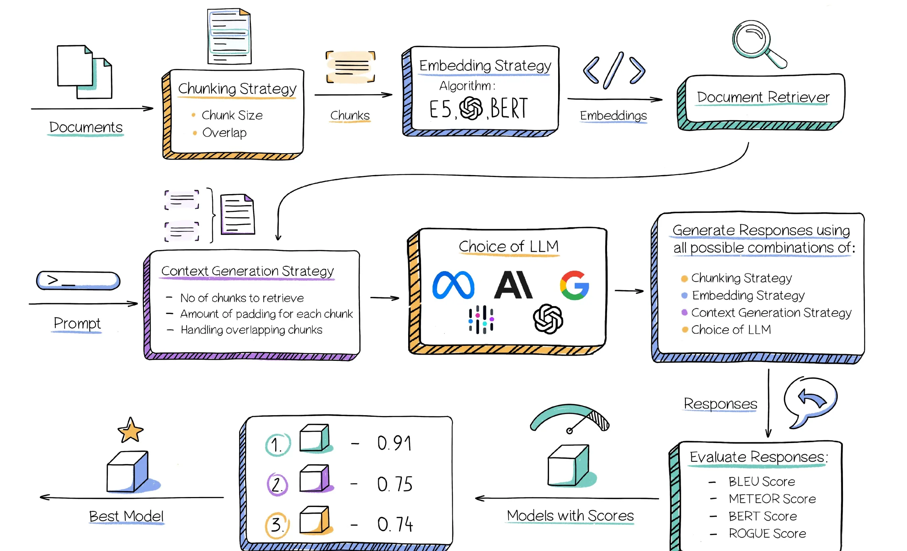

# LLM 探索

> [Create a CustomGPT And Supercharge your Company with AI  –  Pick the Best LLM](https://blog.abacus.ai/blog/2023/08/10/create-your-custom-chatgpt-pick-the-best-llm-that-works-for-you/)

* [信息来源](./source/readme.md)，[杂乱的](./massive.md)
* [书签](./bookmark.md)
* [术语](./terms-and-definitions.md)

## 底层
* [大规模语言模型(LLM)](./base/llm/readme.md)
  * 优化：预训练，微调
  * 评测。评测集。
  * [使用/部署开源模型](./base/llm/use.md)。
* [算力](./base/computing-power/readme.md)\
* 数据
  * Alignment数据

## [开发](./make/readme.md)
* [开发框架](./make/framework/readme.md)
* 技术
  * [Prompt](./make/tech/prompt/readme.md)
  * [Embedding](./make/tech/embedding)
  * [Agent](./make/tech/agent/)
* [Demo 应用 & 部署](./make/deploy)

## [应用](./app/readme.md)
* 应用场景
* 应用

## 资源
* 红杉资本的观察
  * 2022/09 [Generative AI: A Creative New World](https://www.sequoiacap.com/article/generative-ai-a-creative-new-world/) 
  * 2023/09 [Generative AI’s Act Two](https://www.sequoiacap.com/article/generative-ai-act-two/) 
* [一站式 LLM 底层技术原理入门指南](https://s3tlxskbq3.feishu.cn/docx/NyPqdCKraoXz9gxNVCfcIFdnnAc
) 用于零基础入门大语言模型(Large Language Model, LLM)底层技术原理，最直接面向群体为非科班出身但想要了解 AI 技术原理的投资人。
* [Prompt Engineering Guide](https://www.promptingguide.ai/zh)
* [构筑大语言模型应用：应用开发与架构设计](https://aigc.phodal.com/prelude.html)
* [ChatGPT Prompt Engineering for Developers](https://www.deeplearning.ai/short-courses/chatgpt-prompt-engineering-for-developers/) DeepLeaning 出品。
* [23.08.15_大模型赛道的技术和应用分析（残缺）](https://whjlnspmd6.feishu.cn/wiki/DBnWwik1piTB6Iki02CcXoVQn3S)